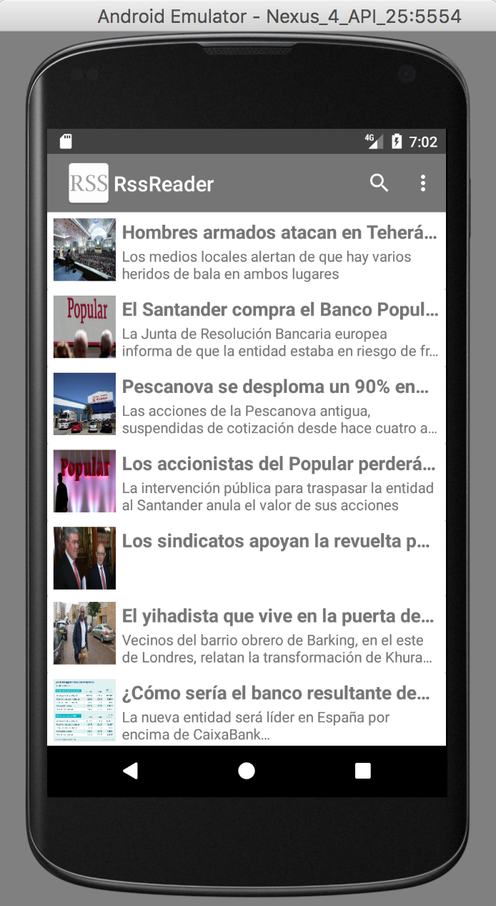
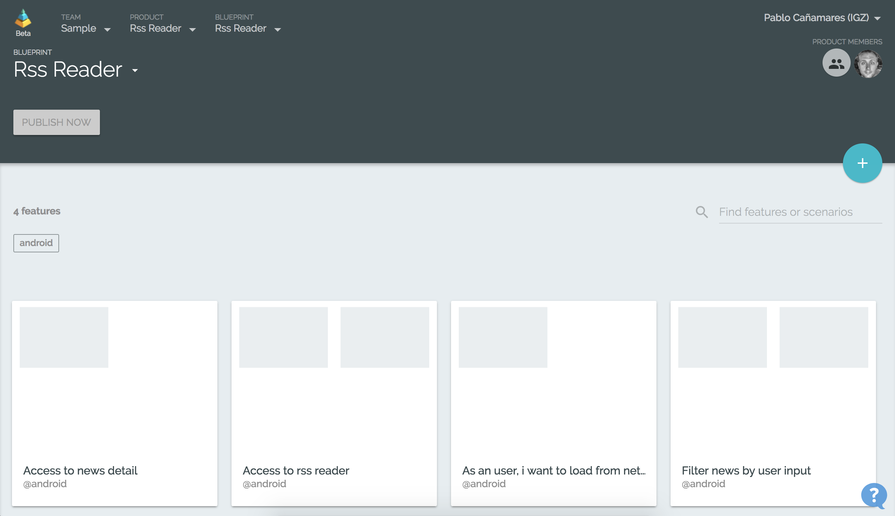
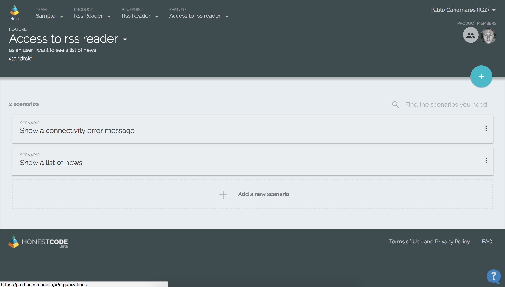
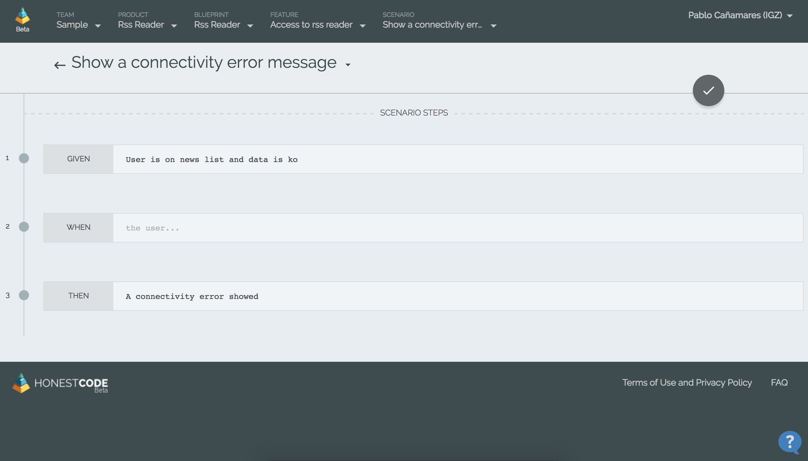
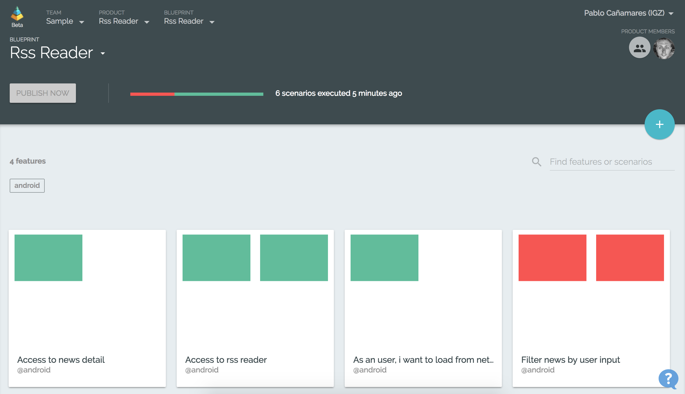

# Rss Android ATDD BDD Demo
Rss Android App BDD / ATDD Demo for HonestCode

## Objetives
This is a simple Android RSS App with some Gherkin Acceptance Tests connected with the service pro.HonestCode.io.

This App is intended to show a functional sample of BDD and ATDD.


## System requisites

* Android Studio
* Android SDK
* Android Emulator properly configured
* Honest Code project configured

## Use

Import this gradle project in Android Studio

### Run tests

Clean, and build project
```
sh ./gradlew clean assembleDevDebug assembleDevDebugAndroidTest
```

Install app and test app

```
adb install -r ./app/build/outputs/apk/app-dev-debug.apk
```

```
adb install -r ./app/build/outputs/apk/app-dev-debug-androidTest.apk
```

Run instrumentation

```
adb shell am instrument -w -r -e package com.igz.rssreader -e debug false com.igz.rssreader.test/com.igz.rssreader.support.runner.CucumberTestRunner
```

Verify execution on emulator

<table>
  <tr>
    <td></td>
    <td></td>
  </tr>
</table>


## HonestCode 
Log in into pro.HonestCode.io (it´s free). Create a Team, product and blueprint. In the Blueprint import the .features files at folder app/src/androidTest/assets/features/










### Upload tests result report to HonestCode
```
adb shell "run-as com.igz.rssreader cat /data/data/com.igz.rssreader/cucumber-reports/cucumber.json" > rssreader-report.json
```

```
curl -XPOST -—data-binary @rssreader-report.json https://pro.honestcode.io/api/hooks/tr/<<HONEST_CODE_KEY>> -v -s
```



